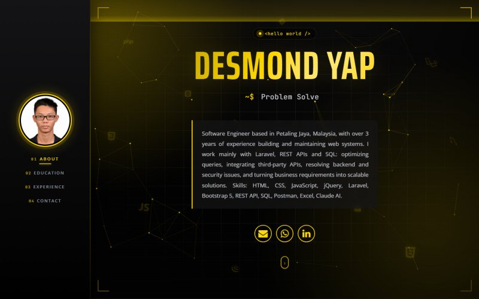
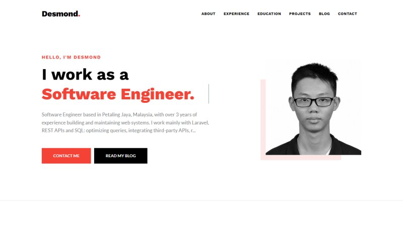
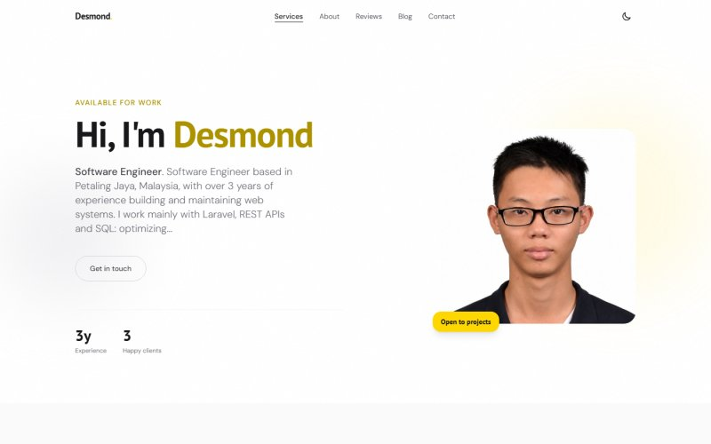

# MyResume — Portfolio CMS

A Laravel application for running a personal portfolio site: you edit your profile, work history, projects, services, testimonials and blog in a back office, and the public site updates immediately.

One installation serves **many people** — each account gets its own site at its own address (`/desmond-yap`), its own content and its own design.

| Back office | Public site |
| --- | --- |
| KaiAdmin dashboard, colour presets, per-module CRUD | 3 switchable templates, all driven by the same data |

---

## Contents

- [Features](#features)
- [Website templates](#website-templates)
- [Tech stack](#tech-stack)
- [Installation](#installation)
- [Creating the first account](#creating-the-first-account)
- [Configuration](#configuration)
- [Security](#security)
- [SEO](#seo)
- [Project structure](#project-structure)
- [Credits and licences](#credits-and-licences)

---

## Features

### Back office (`/admin`)
- **Profile** — photo, role, location, contact links, about text, and the site address (slug).
- **Education, Experience, Project** — full CRUD. Dates may be a month (`2024-05`) or a year only (`2015`), so a CV that gives no month is never shown with an invented one.
- **Service** — title, description and an icon chosen from 12 built-ins, with display order.
- **Testimonial** — client name, role, quote, 1–5 star rating and an optional photo (initials are shown without one).
- **Blog** — multiple images per post, reorderable, with the first image as the cover.
- **Inbox** — messages from the public contact form, with read/unread status.
- **Dashboard** — visitor counts (today and overall) from the visit log.
- **AI Assistant** — chat about your own portfolio, and drop in a CV to fill the modules from it. Runs on a free local model by default; Claude and OpenAI-compatible servers are also supported.
- **Account Setting** — one page with four tabs: password, website template, theme, AI assistant.

### Theming
- Six colour presets (Black Gold, Ocean Blue, Indigo, Light Green, Slate, Rose) plus per-token custom colours.
- Colours are emitted as `--brand-*` CSS custom properties, so a change applies with no build step.
- The **back office** and the **public site** can share one theme or differ, and website colours are remembered **per template**.
- The login page background is configurable: built-in images, your own upload, or a flat colour with an adjustable overlay.

### Public site
- Sections render only when they have content, and the menu follows.
- Each blog post has its own page (Templates 2 and 3) or opens in a reading modal (Template 1).
- Contact form writes straight to the inbox.

---

## Website templates

Chosen per account under **Account Setting → Website Template**.

| Template | Look | Notes |
| --- | --- | --- |
| **1 — Tech Dark** | Dark, animated | Canvas node network, typing terminal line, scroll reveals, blog reading modal |
| **2 — Light Minimal** | Clean and light | Separate page per blog post, image carousel, four-column footer |
| **3 — Modern Studio** | Modern, light/dark | Light/dark switch remembered per visitor, services and testimonials, Tailwind + Alpine |

<p align="center">
  
  
  
</p>

---

## Tech stack

- **PHP** 8.1+ · **Laravel** 10
- **MySQL** 8 (MariaDB works; the migrations use `YEAR` and `JSON` columns)
- **Blade** templates, no SPA
- **Back office:** KaiAdmin (Bootstrap 5), jQuery, Summernote, FilePond, DataTables
- **Templates:** Bootstrap 4/5, Owl Carousel, AOS, Themify icons, Font Awesome, Tailwind (CDN) + Alpine.js for Template 3
- **Images:** processed with PHP GD
- **AI:** Ollama (local, free) · any OpenAI-compatible endpoint · Anthropic PHP SDK · `smalot/pdfparser` for CV text

---

## Installation

```bash
git clone <your-repo-url> myresume
cd myresume
composer install
cp .env.example .env
php artisan key:generate
```

Create the database and point `.env` at it:

```env
APP_URL=https://your-domain.test      # used for canonical URLs and the sitemap
DB_DATABASE=myresume
DB_USERNAME=root
DB_PASSWORD=
```

Then:

```bash
php artisan migrate
php artisan serve        # or serve public/ with Apache/nginx (Laragon, XAMPP, Valet)
```

Uploads are written to `public/uploads`, so that folder must be writable. `php artisan storage:link` is optional and only needed if you add features that use the storage disk.

---

## Creating the first account

There is no public sign-up. Create an account from the console:

```bash
php artisan tinker
```

```php
$user = new App\Models\User();
$user->name = 'Your Name';
$user->slug = 'your-name';              // public address: /your-name
$user->email = 'you@example.com';       // this is the login
$user->password = bcrypt('a-strong-password');
$user->website_template = 'template1';
$user->status = 1;
$user->save();
```

Sign in at `/admin/login`. Your public site is at `/your-name`, and the slug can be changed later under **Profile**. Older base64 links (`/MQ==`) still work and redirect to the slug.

---

## Configuration

| File | What it controls |
| --- | --- |
| `config/branding.php` | Colour presets, the default preset, and the login background |
| `config/website_templates.php` | The list of templates, their names, descriptions and previews |
| `config/service_icons.php` | The service icon set, with a name per icon library (Font Awesome 4/5, Themify, SVG) |
| `config/captcha.php` | Contact form captcha driver and Turnstile keys |
| `config/ai.php` | AI providers, their default addresses and models |

### AI Assistant

The assistant reads an uploaded CV and fills in profile, experience, education and services, and answers questions about the portfolio it can already see. Pick a provider under **Account Setting → AI Assistant**:

| Provider | Cost | Key | Notes |
| --- | --- | --- | --- |
| **Ollama** (default) | Free | None | Runs on your own machine; nothing leaves it |
| **OpenAI-compatible** | Free tiers available | Yes | OpenAI, OpenRouter, Groq, LM Studio, vLLM, llama.cpp |
| **Claude** | Paid | Yes | The only one that reads scanned or photographed CVs |

The free default needs [Ollama](https://ollama.com) and one model:

```bash
ollama pull qwen2.5:7b     # ~4.4 GB
```

A resume takes roughly 45 seconds on a 7B model and about 5 seconds for a chat reply. Ollama and the OpenAI-compatible providers read text out of the PDF first (`smalot/pdfparser`), including hyperlink targets, so a CV that only shows the word "LinkedIn" still yields the address behind it. Neither can read a CV that is a scan or a photo — that needs Claude.

For the OpenAI-compatible option, the server address is whatever your provider documents — `https://api.openai.com/v1` for OpenAI itself, `https://openrouter.ai/api/v1` for OpenRouter. If the model you want is not in the list, choose **Other** and type its name.

Defaults come from the environment when set:

```env
AI_PROVIDER=ollama                    # ollama | compatible | claude
OLLAMA_URL=http://localhost:11434
OLLAMA_MODEL=qwen2.5:7b
ANTHROPIC_API_KEY=sk-ant-...          # only for the Claude provider
```

Keys entered in the back office are encrypted at rest and never sent back to the browser — only a masked hint is shown. Extracted data is always shown for review before anything is written, and the import never touches the login email.

### Contact form captcha

With `CAPTCHA_DRIVER` unset, the driver follows the environment: **Cloudflare Turnstile in production**, a small **sum question** everywhere else. Override it explicitly when needed:

```env
CAPTCHA_DRIVER=turnstile        # turnstile | math | none
TURNSTILE_SITE_KEY=0x4AAAA...
TURNSTILE_SECRET=0x4AAAA...
```

Turnstile with missing keys falls back to the sum question rather than locking the form.

---

## Security

Worth knowing if you fork this:

- **Uploads are re-encoded, not just validated.** Every uploaded image is decoded and redrawn by GD, so only pixels survive; scripts, PHP code and EXIF data are dropped. The filename and extension are chosen by the server, never taken from the browser. Oversized images (over 5000 px) are rejected. See `app/Support/SafeImageUpload.php`.
- **Contact form** — honeypot field, a signed time trap, a rate limit of 5 messages per hour per IP, and a captcha. Submitted text is stored as plain text with HTML stripped. See `app/Support/SpamGuard.php` and `app/Support/Captcha.php`.
- **Admin pages** carry `noindex` and sit behind Laravel's `auth` middleware.
- **Every query is scoped to the signed-in user**, so accounts cannot read or edit each other's content.
- Blog and profile text is written by the account owner and rendered as HTML by design. Visitor-submitted text is always escaped.

Behind a proxy or CDN, configure Laravel's trusted proxies, or the per-IP rate limit will see every visitor as one address.

---

## SEO

- Per-page `<title>`, meta description, canonical URL, Open Graph and Twitter cards (`resources/views/components/website/seo.blade.php`).
- JSON-LD: `Person` on the home page, `BlogPosting` on each post.
- `/sitemap.xml` lists every account's site and posts; `robots.txt` points at it and blocks `/admin`.
- Canonical URLs are built from `APP_URL`, so the same page on another host is not treated as a duplicate.

---

## Project structure

```
app/
├── Http/Controllers/
│   ├── admin/          # one folder per module (Blog, Service, Testimonial, Theme, ...)
│   └── website/        # public site + sitemap
├── Models/             # User, Blog, BlogImage, Service, Testimonial, ThemeSetting, WebsiteTheme, ...
└── Support/
    ├── Branding.php          # resolves colour tokens into CSS variables
    ├── SafeImageUpload.php   # re-encodes uploads
    ├── SpamGuard.php         # honeypot, time trap, rate limit
    ├── Captcha.php           # sum question / Turnstile
    ├── Period.php            # month-or-year date ranges
    └── RoleLabel.php         # short job titles for headlines
resources/views/
├── admin/template1/    # back office pages
├── website/template1..3/   # public templates
└── components/         # shared Blade components (seo, captcha, form-guard, per-template layouts)
public/assets/
├── admin/              # KaiAdmin
└── website/            # per-template CSS, JS and plugins
```

---

## Credits and licences

The bundled front-end templates are third-party work, used under the MIT licence with their licence files kept alongside the assets:

- **Template 2** — "Thomson" by [Themefisher](https://themefisher.com), distributed by [ThemeWagon](https://themewagon.com) · `public/assets/website/template2/LICENSE.txt`
- **Template 3** — "Folio" by Laurent Begey, distributed by [ThemeWagon](https://themewagon.com) · `public/assets/website/template3/LICENSE.txt` (Tailwind and Alpine load from CDNs, so no vendor files are bundled)
- **Back office** — KaiAdmin by Themekita

This repository has no licence file of its own yet. Add one before sharing the code if you want others to reuse it.
